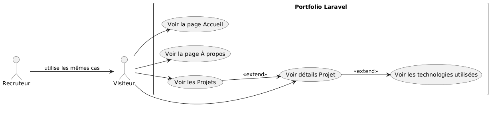

# Mini-Site Personnel
**Yasmine Had-dad**  
Supervisé par : M. Essarraj Fouad

---

## Cahier des charges
- **Objectif**: 
  - Montrer les projets et réalisations de Fadna de façon professionnelle.  
  - Permettre aux visiteurs de me contacter facilement.  
  - Donner une image moderne et professionnelle de mon travail.  
- **Public cible**: Recruteurs, entreprises tech, clients potentiels, professionnels du web.  
- **Fonctionnalités**: Page Accueil, À propos, Projets, Contact.  
- **Livrables**: Site fonctionnel avec code source et guide d’utilisation.  

---

## Exemple de l’existant

---

## Diagramme de cas d’utilisation

---

## Conception:
**Schema:**

---

## Conception:
**Maquette**

